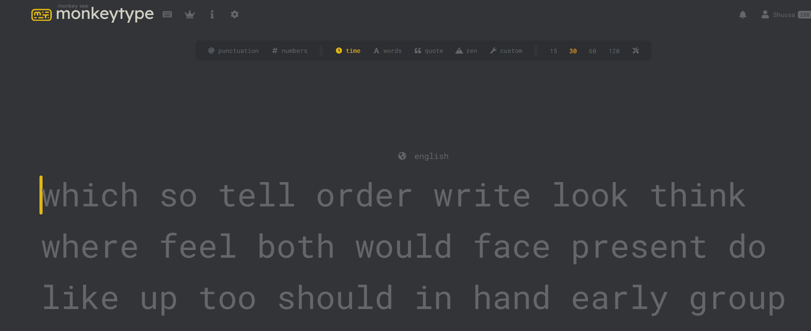
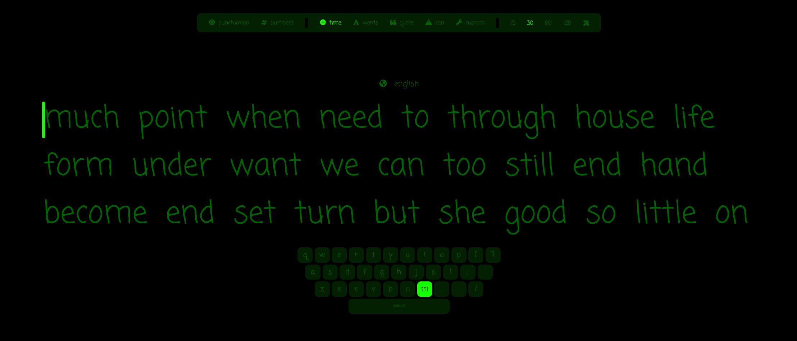

## Предусловие

Предполагается, что к этому времени участник клуба уже ориентируется +- в кнопках, не обязательно точно на все нажимает, но по соседней попасть может. Если же ты совсем новичек, то для начала стоит подучить клавиатуру. Рекомендую тут: Хороший источник для начинающих это сайт [Touch Typing Practice Online](https://www.typingstudy.com). Тут есть 15 уроков. Необходимо ежедневно проходить по одному уроку. Урок считается пройденнм, когда в каждом упражнении удалось достичь 100% точности, как на примере ниже. СКОРОСТЬ НЕ ВАЖНА - забудь о ней!

Если уже неплохо ориентируешься в раскладке, но класть пальцы - есть все еще какая-то неуверенность, тогда твой путь начнется сразу на [Monkeytype | A minimalistic, customizable typing test](https://monkeytype.com). На Monkeytype есть все инструменты для достижения скорости печати 300+ слов в минуту при должном усердии. Но пока что рано думать об этом.

## Подготовка

### Регистрация

Регистрация на сайте **обязательна**. В профиле будут отображаться ваши достижения. Можно будет отслеживать прогресс и анализировать свои слабые стороны.

По умолчанию сайт выглядит вот так. Давай сделаем его немного удобнее!

## Обшие найстройки

1.  **Быстрый рестарт** теста на клавишу Tab. Нажми Esc -> Quick restart -> Tab.
2. **Размер шрифта**. Рекомендую выставить font size 4. Будет виднее и можно будет сфокусироваться на самих клавишах. Нажми Esc -> Font size -> 4

2. **Подстветка следующей нажимаемой клавиши**. Если пока-что не уверенно нащупываешь клавиши. Нажми Esc -> Keymap -> next
3. Отображение текущей точности. Нажми Esc -> Live acc style -> text.

### Внешний вид

В настройках можно задать шрифт и тему, выбери себе подходящую. Например Coming soon + Matrix :). Важно выбирать шрифт, где хорошо различаются буквы **a o**, **i l j**, **s 5**.
