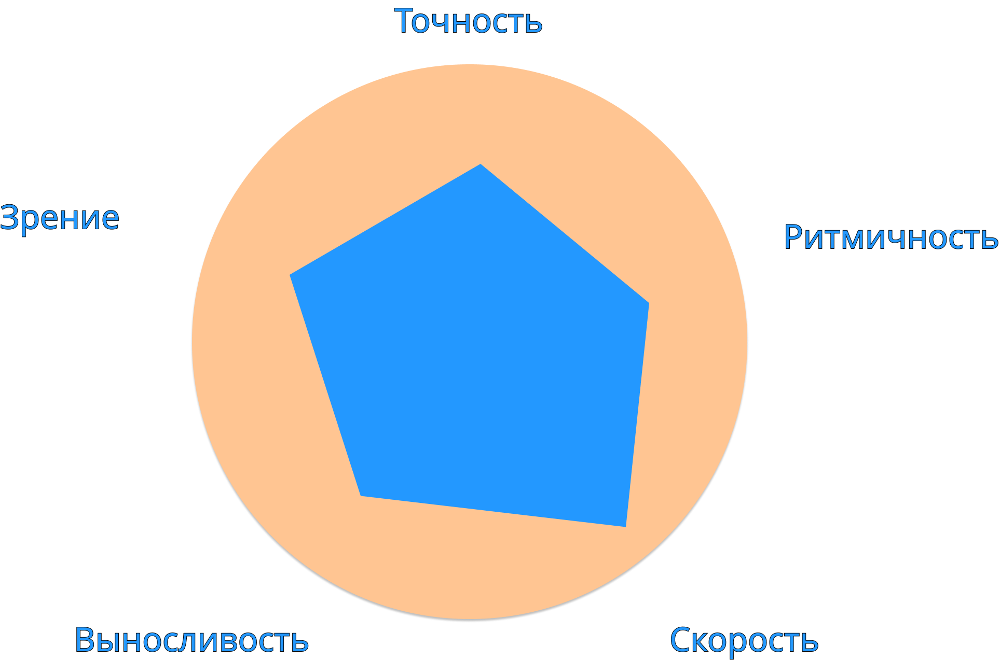

 ## Нерушимые заповеди
 
 Эти правила нужно помнить даже когда печатаешь 300 слов в минуту! Нарушил правила - покидаешь бойцовский клуб, Тайлер будет разочарован.

 1. Главное: ТОЧНОСТЬ это друг, скорость это враг! Как только в приориет ставится скорость, можно считать, что дальше процесс освоения навыка будет идти очень медленно. Если торопишься, ты проиграл!
 2. Последовательность и плавность ввода важнее равков по несколько клавиш за раз. Лучше печатать всю последовательность медленно, чем часть последовательности медленно, а часть быстро. Найди комфортную скорость и почувствуй ритм, да, пусть скорость будет 20 слов в минуту, помни, начнешь думать о скорости - проиграл!
 3. Если начал совершать частые ошибки, срочно делай перерыв. В противном случае вместе с правильным механическим закреплением могут начать появляться паразитные привычки: путать местами коавиши, машинально нажимать 2 клавиши в обратном опрядке, вводить лишние ссимволы, не допечатывать слова до конц. Все эти привычки очень сложно исправляются, поэтому начал ошибаться из-за усталости? Потянуло на скорость? Появились другие дела? Тогда переставай печатать, тебя ждет латте на миндальном молоке с лавандовым сиропом!
 4. Между сессиями должен быть перерыв хотя бы 2 часа. Сами сессии не больше 20 минут, даже если очень хочется еще или ну вот щас, рекодр побью!
 5. Регулярность. Лучше 15 минут каждый день печатать, чем через день, но по часу. Во первых, за час очень сильно устанешь и заскучаешь, во вторых понацепляшь паразитные привычки. В третьих потратишь больше времени и результат будет ХУЖЕ.

 ## Элементарные составляющие

 Печатание на клавиатуре можно разделить на элементарные составляющие, навыки.
 У нас есть 5 элементарных навыков:
 1. Точность - количество правильных символов в минуту
 2. Скорость - количество нажатий на "правильные" на твой взгляд символы в минуту
 3. Ритмичность - умени держать одинаковый поток нажатий. В терминах РПГ эта виличина называлась бы множитель опыта. Чем ритмичнее печатаешь, тем быстрее будет прогресс.
 4. Зрение - Дальность обзора следующих слов
 5. Выносливость - длительность сесии печатания в минутах, перед наступлением резкого падения всех параметров, обычно равно усталости пальцев.
 Диаграмма развития навыка:
 

 Эта диаграмма описывает параметры автора. Легко заметить, что уклон идет в сторону скорости, остальные параметры догоняют.
 Для упражнений в этой методичке будут обозначать различные метки, на что направлено то или иное задание. Важно обращать на это внимание и фокусироваться именно на тех параметрах, которые пытаемся потренировать.

 ### Пример

 1. Напечатать 100 слов подряд с точностью 98% (Точность+).
 2. Печатать набор слов eng 1000 в течении 10 минут и бегущей кареткой. (Р+, В++).

 Далее все эти навыки будут сокращены до одной буквы:
 1. Т - Точность.
 2. С - Скорость.
 3. Р - Ритмичность.
 4. З - Зрение.
 5. В - Выносливость.

 ## 2 Уровня задания:
 У каждого задания будет 2 чекпоинта:
 1. Обязательный описывается обычным текстом.
 2. Опциональный и задания со звездочной описываются выделенным шрифтом.

 ### Пример

 Напечатать 100 слов за 30 секунд с точностью выше 90%.

 ## Термины

 6. WPM - Скорость слов в минуту. Words per minute.
 7. ACC - Точность нажатия на клавиши. Accuracy.
 8. PACE - Бегущая картека, которая соревнутся с курсором пользователя.
 9. TIME - время одной итеграции задания.

 ## Модификаторы

 Для тренировки того или иного аспекта мы будем использовать различные модификаторы с сайта monkeytype. Ниже приведен полный список модификаторов и как их настроить:

 1. Funbox - Random Case. `Esc -> Funbox -> Random Case`
 2. Funbox - Read ahead. `Esc -> Funbox -> Read ahead`
 3. Funbox - Plus One, Plus Zero. `Esc -> Funbox -> Plus ...`
 4. Pace caret - Daily, Custom. `Esc -> Pace caret -> daily, custom`
 5. Difficulty - Master, expert. `Esc -> Difficulty -> Master, expert`
 6. Blind mode - `True.Esc -> Blind mode -> True`
 7. Mode - works, time, quote. Просто выбери: `time`, `words` или `quote`
